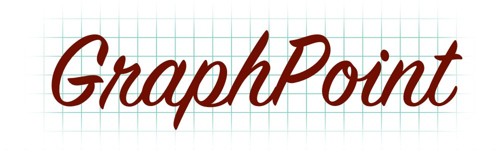

<p align="center">
    
</p>

<p align="center">
    
    <a href="https://swift.org/package-manager">
        
    </a>
     
    <a href="https://twitter.com/richardpiazza">
        
    </a>
</p>

<p align="center">A Swift implementation of the Cartesian Coordinate System within <code>CGRect</code>.</p>

## Installation

**GraphPoint** is distributed using the [Swift Package Manager](https://swift.org/package-manager). To install it into a project, add it as a dependency within your `Package.swift` manifest:

```swift
let package = Package(
    ...
    dependencies: [
        .package(url: "https://github.com/richardpiazza/GraphPoint.git", from: "4.0.0")
    ],
    ...
)
```

Then import **GraphPoint** wherever you'd like to use it:

```swift
import GraphPoint
```

## Usage


GraphPoint is a library of Swift extensions for using a [Cartesian Coordinate System](https://en.wikipedia.org/wiki/Cartesian_coordinate_system) with CGRect.
The Cartesian Coordinate System defines the origin as the center point and
it uses several mathematical laws to determine angles and points within a CGRect.

For Example:

- Given a CGRect(0, 0, 100, 100)
- The origin would be CGPoint(50, 50)
- A CGPoint(75, 75) would be translated to GraphPoint(25, -25)
