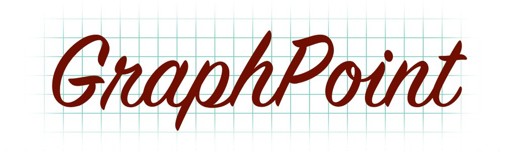

<p align="center">
    
</p>

A Swift implementation of the <a href="https://en.wikipedia.org/wiki/Cartesian_coordinate_system">Cartesian Coordinate System</a>.

[](https://swiftpackageindex.com/richardpiazza/GraphPoint)
[](https://swiftpackageindex.com/richardpiazza/GraphPoint)

## Dependencies

**GraphPoint** relies heavily on the **[Swift2D](https://github.com/richardpiazza/Swift2D)** library, which reimplements `Rect`, `Size`, and 
`Point` in a cross-platform, non-Foundation reliant way.

## Usage

There are several key aspects to understand when using **GraphPoint**.

### `CartesianPlane`

A Cartesian plane is defined by two perpendicular number lines: the x-axis, which is horizontal, and the y-axis, which is vertical. Using these 
axes, we can describe any point in the plane using an ordered pair of numbers.

In **GraphPoint** ever rectangle is a cartesian plane with the origin at the center.

### `CartesianFrame`

A `Rect` contained within a `CartesianPlane` with an `origin` relative to the `cartesianOrigin` of the plane. For example:

```swift
// Visualize graph paper with axes extending 50 points in all four directions from the center of the paper.
let plane = CartesianPlan(size: Size(width: 100, height: 100))
// A 10x10 piece of paper is placed on top of the graph paper; placed 40 points from both the top and left edges. 
let rect = Rect(origin: Point(x: 40, y: 40), size: Size(width: 10, height: 10))
// In relation to the graph, the smaller rectangle would have an 'origin' at (-10, 10).
let cartesianFrame = plane.rect(for: rect)
cartesianFrame == Rect(origin: Point(x: -10, y: 10), size: Size(width: 10, height: 10))
```

### `CartesianPoint`

A point within a `CartesianPlane`. The x & y coordinates of a `CartesianPoint` represent the offset from the planes 'origin' (0, 0).

## Deprecations

The `CoreGraphics` aliases have been deprecated and replaced by their _Cartesian_ counterparts. These type-aliases and 
**GraphPointUI** will be removed in a future version.

## Installation

**GraphPoint** is distributed using the [Swift Package Manager](https://swift.org/package-manager). To install it into a project, add it as a 
dependency within your `Package.swift` manifest:

```swift
let package = Package(
    ...
    dependencies: [
        .package(url: "https://github.com/richardpiazza/GraphPoint.git", from: "4.0.0")
    ],
    ...
)
```

Then import **GraphPoint** wherever you'd like to use it:

```swift
import GraphPoint
```
